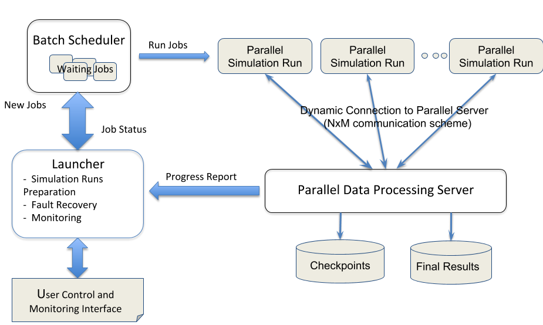

# Melissa Sensitivity Analysis

## Table of Contents

* [About](#about)
* [Documentation](#melissa-documentation)
* [News](#news)
* [Getting Started](#getting-started)
* [Sensitivity Analysis with Melissa](#sensitivity-analysis-with-melissa)
* [Command Reference](#command-reference)
* [Troubleshooting](#troubleshooting)
* [License](#license)
* [How to cite Melissa](#how-to-cite-melissa)
* [Publications](#publications)
* [Dependencies](#dependencies)
* [Development Hints](#development-hints)


## About

Melissa is a file avoiding,  fault tolerant and elastic framework, to run _large scale sensitivity analysis_  on  supercomputers.  Largest runs so far involved up to 30k core, executed 80 000 parallel simulations,  and  generated 288 TB of intermediate data that did not need to be stored on the file system.

Classical sensitivity analysis consists in running different  instances of the simulation with different set of input parameters, store the results to disk  to later read them back from disk to compute the required statistics. The amount of storage needed can quickly become overwhelming, with the associated long read time that makes statistic computing time consuming. To avoid this pitfall, scientists reduce their study size by running low resolution simulations or down-sampling output data in space and time. 

Melissa bypasses this limitation by avoiding intermediate file storage. Melissa   processes the data online  (in transit)   enabling very large scale sensitivity analysis.  Melissa is built around two key concepts: iterative (sometimes also called incremenalt) statistics algorithms and asynchronous client/server model for data transfer. Simulation outputs are never stored on disc. They are sent by the simulations to a parallel server, which aggregate them to the statistic fields in an iterative fashion, and then throw them away. This allows to compute oblivious statistics maps on every mesh element for every timestep on a full scale study. 

Melissa  comes with iterative algorithms for computing the average, variance and co-variance, skewness, kurtosis, max, min, threshold exceedance, quantiles and Sobol' indices, and can easily be extended with new algorithms.

Melissa architecture relies on 3 interacting  components:
* Melissa runner (client):  the parallel  numerical simulation code turned into a client.  Each client sends its ouput to the server as soon as available. Clients are independent jobs.
* Melissa server: a  parallel executable in charge of computing statistics.  The server update   statistics upon reception of new data from any one of the connected clients. 
* Melissa Launcher: the fron-end  Python script in charge of orchestrating the execution of the  global sensitivity analysis. This is the user entry point to configure the sensibility analysis study. 

To run a sensitivity analysis with Melissa, a user needs to: 
* Instrument the simulation code with the Melissa API (3 base calls: init, send and finalize) so it can become a Melissa runner.
* Configure  the sensibility analysis (how to draw the paremeters for each simulation execution, statistics to compute)
* Start the Melissa launcher on the  front-end of the supercomputer.  Melissa takes care of requesting resources to execute the server and runner, monitor the execution,  restarting  failing components when necesary.

For more details on the Melissa model for sensibility analysis  refer to [PDF](https://hal.inria.fr/hal-01607479/file/main-Sobol-SC-2017-HALVERSION.pdf).




## News

* **February 2021 Update** (Version 0.7)
  * Melissa additionally works on CentOS 7, CentOS 8, and Alpine Linux now
  * Renamed CMake variable `ZeroMQ_DIR` to `ZeroMQ_ROOT`; starting with CMake 3.12, CMake began transparently uses these variables to search for packages, before that many programmers were using this naming scheme in their CMake setup
  * Fixed the CMake target import
  * Made import of launcher as Python3 package easier
  * Reduced the amount of user-provided code in `options.py` needed to run simulations
  * Updated Slurm support for clusters without mpirun (cf. [Spack package manager issue #10340](https://github.com/spack/spack/pull/10340))
  * Updated the Code\_Saturne example for Code\_Saturne 6
  * Improved code quality (e.g., more tests, fixed compiler warnings)
  * Removed deprecated code including Python2 code, obsolete Python modules, and old C functions
* **Jan 2020: GitHub continuous update**
  * Sync our work repo with the github repo so all changes are immediately visible to all
  * Major code restructuring  and documentation update
  * New tools for supporting a virtual cluster mode  and using Jupyter notebook for controlling a Melissa run
* **Nov 2018: Melissa release 0.5 available on GitHub**
  * Changes in the API: remove arguments from the `melissa_send` function
  * Add batch mode
  * Improve launcher fault tolerance
  * Improve the examples and the install tree
  * Many fixes
* **Nov 2017: Melissa release 0.4 available on GitHub**
  * Improve quantiles and threshold exceedances
  * Add iterative skewness and kurtosis
  * Add a restart mechanism over results of previous study
  * Add FlowVR coupling mechanism for Sobol' groups
  * Add Telemac2D example, including FlowVR coupling mechanism
  * Many bug fixes


## Melissa Documentation

Melissa documentation comes with the code and  is spread in README.md files as close as possible to the concerned code.  You are right now at the root README.md of this doc. 


## Getting Started

### Install Melissa


#### Code Download

Download Melissa sources [here](https://github.com/melissa-sa/melissa).

#### Dependencies

* CMake 3.7.2 or newer
* GNU Make
* A C99 compiler
* A C++ compiler
* MPI
* ZeroMQ 4.1.5 or newer
* Python 3.5.3 or newer
* NumPy (for Python3)

CMake can download and install ZeroMQ if the flag `-DINSTALL_ZMQ=ON` is passed to CMake. The Melissa header for Fortran90 will always be installed.

If you are unsure if all dependencies are installed, simply run CMake because it will find all required software packages automatically and check their version numbers or print error messages otherwise.


#### Compilation and Installation

Create a build directory and change directories:
```sh
mkdir build
cd build
```
Call CMake and customize the build by passing build options on its command line (see the table below). The build here has a compiler optimizations enabled:
```sh
cmake -DCMAKE_BUILD_TYPE=Release -- ../
make
make test
make install
```
Update environment variables to ensure the Melissa launcher and server can be found by the shell:
```sh
source ../install/bin/melissa-setup-env.sh
```
This command needs to be executed whenever you start a new shell.


#### Build Options

| CMake option | Default value | Description |
| -- | -- | -- |
| `-DCMAKE_BUILD_TYPE` | `Debug` | Build type (try `Debug` or `Release`) |
| `-DCMAKE_INSTALL_PREFIX` | `../install` | Melissa installation directory |
| `-DZeroMQ_ROOT` | -- | The path to the ZeroMQ installation directory (only needed for nonstandard paths) |
| `-DINSTALL_ZMQ` | `OFF` | Download, build, and install ZeroMQ |
| `-DBUILD_DOCUMENTATION` | `OFF` | Build the documentation (requires Doxygen) |
| `-DBUILD_TESTING` | `ON` | Build tests; run with `make test` in build directory |


### Run a first example


Go to  the heat example [README.md](examples/heat-pde/README.md) to run your first sensitivity analysis with melissa


## Sensitivity Analysis with Melissa

A sensitivity analysis with Melissa requires
* simulation code augmented with Melissa function calls,
* a configuration file with the desired statistics,
* how to launch MPI jobs, and
* calling the Melissa launcher.


#### Augmenting the Simulation Code

From the point of view of Melissa, a simulation manages the state of one or more fields or quantities (e.g., energy, temperature, or pressure). Each field or quantity can have its own mesh but these meshes must be **fixed**. For each kind of value to be analyzed by Melissa, the simulation must call
```c
#include <melissa/api.h>
melissa_init("value-kind", grid_size, mpi_communicator);
```
The MPI communicator must be application specific (see the `MPI_Comm_get_attr` documentation regarding the property `MPI_APPNUM`). For every timestep and for every kind of value, the simulation must call
```c
#include <melissa/api.h>
const double* values = ...;
melissa_send("value-kind", values);
```
Keep in mind that one timestep for Melissa does not have to equal one timestep in the simulation. After all data was sent, the simulation must call
```c
#include <melissa/api.h>
melissa_finalize();
```
This statement is obligatory and must take place before `MPI_Finalize()` is called.


#### Melissa Options File

For a sensitivity analysis, you must decide
* which statistics you want Melissa to compute,
* which input variables shall be part of the sensitivity analysis,
* which input values are of interest for a sensitivity analysis, and
* which output variables shall be part of the sensitivity analysis.

This information must be passed to Melissa in a Python file commonly called `options.py`. It is suggested to adopt one of the options files given in the example folder:
* For every desired statistic, set the right-hand side to `True`. For all other statistics, set them to `False`.
* For every input variable part of the sensitivity analysis, generate a value in the function `draw_param_set()`. The [NumPy `random` module](https://numpy.org/doc/stable/reference/random/index.html) may be helpful.
* For every output variable part of the sensitivity analysis, pass its name to the array `STUDY_OPTIONS['field_names']`.

The function `draw_param_set()` must return a NumPy array of double-precision floating-point values (NumPy dtype `np.float64`). The function will be invoked repeatedly and every invocation must return the same number of values.

The NumPy developers are routinely adding functionality to their library. Make sure to use a version of the NumPy documentation matching the NumPy version on your computer or the code might not work.


#### MPI Job Launcher

Melissa knows several ways to launch MPI jobs. Local jobs can be started with OpenMPI, on a cluster the batch schedulers Slurm and OAR can be employed. Before you run the sensitivity analysis, you must decide on an available method.


#### Starting the Sensitivity Analysis

The sensitivity analysis can be launched with the aid of the Melissa launcher. First, ensure the Melissa launcher can be executed by updating the environment variables. Locate the Melissa installation directory and execute
```sh
source bin/melissa-setup-env.sh
```
The Melissa command line has the following structure:
```sh
melissa-launcher openmpi options.py simulation
```
The first argument (here: `openmpi`) selects the way MPI jobs are started, the second argument is the path to the Melissa options file, and the third argument is either the name of the simulation executable. Paragraphs below discuss how Melissa locates simulation executables and how the simulation is called by Melissa.

This paragraph discusses how simulation executables are located. On the Melissa launcher command line, if suffices to pass only the executable name if the executable is located in one of the directories in the `PATH` environment variable. This is the case if you can simply type the simulation name in the terminal to start it as in `code-sol --help`, where `code-sol` is the name of the simulation. The other possibility is to provide the absolute path on the launcher command line.

The next paragraphs discuss how simulations are started by Melissa. For the sensitivity analysis, Melissa must run the simulation with the inout values generated by the user-provided function `draw_param_set()` (see the description of the Melissa options file above). Melissa will pass the input values on the simulation command line. For example, if there are two input values 3.14 and 159.0, then Melissa will run `simulation 3.14 159.0`. If you need to customize the simulation launch, then you can replace the actual simulation with a script that calls the simulation. Such a script will be called _simulation script_ for the purposes of this README. For example:
```sh
#!/bin/sh

set -eu
exec code-sol --input "$1" --input "$2"
```
The two requirements for such a script are that
* it accepts the simulation input values on the command line and
* it is executable, i.e., the executable bits are set.

Pay attention to the fact that every MPI job will execute the script! On a computer cluster, the different script executions may take on different computers.

In some cases the simulation needs a special setup. For example, certain directories may need to be present or the input values must be written to files. The Melissa launcher can execute the simulation script in two steps if the argument `--with-simulation-setup` is passed on the command line: `melissa-launcher --with-simulation-setup openmpi options.py ./code-sol.sh`. The simulation script will be called twice then:
* In the first step, the simulation script is called on the user's computer once and the additional argument `initialize` will be passed on the command line in addition to the simulation's input values (e.g., `./code-sol.sh initialize 3.14 159.0`).
* After the simulation script exited successfully, the launcher will start the MPI jobs. Every MPI job will invoke the simulation script with the argument `execute` and the input parameters (e.g., `./code-sol.sh execute 3.14 159.0`).


## Command Reference

### Launcher

The launcher command line looks as follows:
```sh
melissa-launcher <scheduler> <options> <simulation>
```
Scheduler is one of the available schedulers (call `melissa-launcher --help` for an up-to-date list), `options` is a path to a Python file with the Melissa options, and simulation is the name or the complete path to a simulation executable.


#### `--help`

The launcher will shows an overview of all command line options, all available schedulers and exit.

#### `--version`

The launcher will show the Melissa version and exit.


### `--output-dir <directory-template>`

A sensitivity analysis may generate a large number of files and for this reason, Melissa creates a new subdirectory of the current working directory for all of its outputs. By default, the directory name is the local time and date in [ISO 8601](https://www.iso.org/iso-8601-date-and-time-format.html) basic format, e.g., on December 7, 1999, at 12:34:56pm local time, the ISO 8601 timestamp is `19991207T123456`.


The `--output-dir` options allows users to change the directory name. Furthermore, the argument value will be given to the standard C function [`strftime`](https://pubs.opengroup.org/onlinepubs/009695399/functions/strftime.html).

Examples:
* `--output-dir='..'` makes Melissa write to the parent directory.
* `--output-dir='project-alpha'` makes Melissa write to a directory called `project-alpha`.
* `--output-dir='project-beta-%T'`: output directory `project-beta-19:12:00` (local time 7:12pm).


**CAUTION**:
* Existing content in the output directory will be overwritten and/or erased.
* Clock changes (e.g., from winter to summer time) may cause Melissa to generate the same output directory name twice.
* Leap seconds may cause timestamps with "60" as the number of seconds (instead of only 00 to 59).
* The single ticks in the examples above stop POSIX-compliants shells from modifying the argument value.


#### `--scheduler-arg SCHEDULER_ARG`

This option allows one to pass arguments directly to the batch scheduler. This can be used, e.g., on a supercomputer to pass accounting information or select queues. For example, with the Slurm batch scheduler, the account can be selected as follows:
```sh
srun --account='melissa-devs' --ntasks=1 code-sol 3.14 159.0
```
Continuing the example, Melissa can be made to use this account as follows:
```sh
melissa-launcher --scheduler-arg=--account=melissa-devs slurm options.py code-sol
```

**CAUTION**: The Melissa command line parser cannot handle spaces in the argument value, e.g.,
* `--scheduler-arg '--account=melissa-devs'` works whereas
* `--scheduler-arg='-A melissa-devs'` does not work.

**CAUTION**: Do not modify the number of processes (or tasks) using `--scheduler-arg`, use `--num-client-processes` and `--num-server-processes` instead. Melissa needs to track the number of server and client processes to make proper resource allocation requests but since the launcher does not examine scheduler arguments, it cannot inrporate this data into its requests.


#### `--scheduler-arg-client SCHEDULER_ARG_CLIENT`

This option is identical to `--scheduler-arg` except that the argument values are only passed to the batch scheduler when launching clients.

#### `--scheduler-arg-server SCHEDULER_ARG_SERVER`

This option is identical to `--scheduler-arg` except that the argument values are only passed to the batch scheduler when launching servers.


#### `--num-client-processes NUM_CLIENT_PROCESSES`

The number of MPI processes of clients.


#### `--num-server-processes NUM_SERVER_PROCESSES`

The number of MPI processes of servers.


#### `--with-simulation-setup`

This option makes the Melissa launcher run the simulation once without MPI on the local computer before actually starting the simulation via the batch scheduler. This can useful, e.g., to set up directories or modify simulation input files.

Without this option, every MPI processes will start the simulation as follows (3.14, 159.0 are the input values passed by the launcher to the simulation):
```sh
mpirun -n 10 -- simulation 3.14 159.0
```
With this option, the simulation will be run twice and an additional argument will be passed on the command line. The first run is local without MPI:
```sh
simulation initialize 3.14 159.0
```
Only the second run invokes MPI (and may take place on another computer when working on computer clusters):
```sh
mpirun -n 10 -- simulation execute 3.14 159.0
```


## Melissa Client API

The Melissa Client API provides functions for sending simulation data to a Melissa server for statistical analysis. The client API header file is `melissa/api.h`. the Melissa client code can be found in a library called `melissa`; link with `-lmelissa`.


### Augmenting a Simulation

To make a simulation send data to the Melissa server one has to
* identify the fields (or quantities) that shall be analyzed by Melissa,
* identify where the quantities are stored in the simulation memory,
* call `MPI_Init()` if needed,
* call `melissa_init()` once for every quantity to be analyzed,
* call `melissa_send()` once for every quantity to be analyzed and for every time step, and
* call `melissa_finalize()` before terminating the simulation and/or calling `MPI_Finalize()`.

Pay attention to the following items:
* The list of quantities to be analyzed must be added and be kept up-to-date in the Melissa options file `options.py`.
* A Melissa time step does not necessarily equal one simulation time step.
* The dimension of the field to be analyzed must be constant. Melissa does not support fields of variable dimension.
* If Sobol' indices are to be computed and if the MPI coupling shall be used, then the MPI communicator passed to Melissa must be simulation-specific, i.e., the communicator returned by `MPI_Comm_get_attr(MPI_COMM_WORLD, MPI_APPNUM, ...)`.


### Client API

The most interesting headers for Melissa users are `melissa/api.h` and `melissa/config.h`. The latter file defines preprocessor macros for the Melissa version and the enabled features.


## Troubleshooting

### CMake does not find MPI with Intel Compilers 19

Error message:
```
-- Could NOT find MPI_C (missing: MPI_C_WORKS)
```

Solution: Make CMake invoke the Intel Compiler instead of GCC.
```sh
env CC=icc CXX=icpc cmake -- /path/to/melissa
```


## License

Melissa is open source under the [BSD 3-Clause License](LICENSE).


## How to cite Melissa

Melissa: Large Scale In Transit Sensitivity Analysis Avoiding Intermediate Files. Théophile Terraz, Alejandro Ribes, Yvan Fournier, Bertrand Iooss, Bruno Raffin. The International Conference for High Performance Computing, Networking, Storage and Analysis (Supercomputing), Nov 2017, Denver, United States. pp.1 - 14.


```
inproceedings{terraz:hal-01607479,
  TITLE = {{Melissa: Large Scale In Transit Sensitivity Analysis Avoiding Intermediate Files}},
  AUTHOR = {Terraz, Th{\'e}ophile and Ribes, Alejandro and Fournier, Yvan and Iooss, Bertrand and Raffin, Bruno},
  URL = {https://hal.inria.fr/hal-01607479},
  BOOKTITLE = {{The International Conference for High Performance Computing, Networking, Storage and Analysis (Supercomputing)}},
  ADDRESS = {Denver, United States},
  PAGES = {1 - 14},
  YEAR = {2017},
  MONTH = Nov,
  KEYWORDS = {Sensitivity Analysis ; Multi-run Simulations ; Ensemble Simulation ; Sobol' Index ; In Transit Processing},
  PDF = {https://hal.inria.fr/hal-01607479/file/main-Sobol-SC-2017-HALVERSION.pdf},
  HAL_ID = {hal-01607479},
  HAL_VERSION = {v1},
```


## Publications
   * Melissa: Large Scale In Transit Sensitivity Analysis Avoiding Intermediate Files. Théophile Terraz, Alejandro Ribes, Yvan Fournier, Bertrand Iooss, Bruno Raffin. The International Conference for High Performance Computing, Networking, Storage and Analysis (Supercomputing), Nov 2017, Denver, United States. pp.1 - 14. [PDF](https://hal.inria.fr/hal-01607479/file/main-Sobol-SC-2017-HALVERSION.pdf)
   * The Challenges of In Situ Analysis for Multiple Simulations. Alejandro Ribés, Bruno Raffin.  ISAV 2020 – In Situ Infrastructures for Enabling Extreme-Scale Analysis and Visualization, Nov 2020, Atlanta, United States. pp.1-6. (https://hal.inria.fr/hal-02968789)


## Dependencies

Melissa would not exist without high-quality C compilers, Fortran compilers, Python interpreters, standard language libraries, build systems, development tools, text editors, command line tools, and Linux distributions. The Melissa developers want to thank all developers, maintainers, forum moderators and everybody else who helped to improve these pieces of software.

Melissa links against [ØMQ](https://zeromq.org/) (ZeroMQ) and because Melissa may be _distributing in binary form_ (when static linking is enabled), we are obliged to mention that ZeroMQ is available under the terms of the [GNU Lesser General Public License version 3 with static linking exception](http://wiki.zeromq.org/area:licensing).

Copies of the licenses can be found in the folder [`licenses`](licenses).


## Development Hints

### C and C++

C and C++ are easily susceptible to memory bugs and undefined behavior. For example, the following C99 code shows undefined behavior because the literal `1` is taken to be a _signed_ integer by compiler:
```c
#include <stdint.h>
uint32_t u = 1 << 31;
```
This is the corrected code:
```c
#include <stdint.h>
uint32_t u = UINT32_C(1) << 31;
```

Many of these errors can be detected at compile-time if warnings are enabled and at run-time with the aid of the [_address sanitizer_](https://github.com/google/sanitizers/wiki/AddressSanitizer) (ASAN) and the [_undefined behavior sanitizer_](https://clang.llvm.org/docs/UndefinedBehaviorSanitizer.html) (UBSAN). Both sanitizers are supported by GCC and Clang.

Most warnings are already enabled in `CMakeLists.txt`.

To enable the sanitiers, pass `-fsanitize=address` for ASAN and `-fsanitize=undefined` for UBSAN on the compiler command line. When using CMake, export the following environment flags before calling CMake:
```sh
export CFLAGS='-fsanitize=address -fsanitize=undefined'
export CXXFLAGS='-fsanitize=address -fsanitize=undefined'
```
Afterwards build the code as usual with `make` and `make install`. If an error is detected, the sanitizers print file and line data if debugging information is present in the executable files. This can be done either by adding the compiler flag `-g` to the compiler options or by settings `-DCMAKE_BUILD_TYPE=Debug` on the CMake command line.

As of August 2020, some Melissa tests seems to be leaking memory. To ignore memory leaks (and have ASAN only check for memory corruption), set the following environment flag before running the tests:
```sh
env ASAN_OPTIONS='leak_check_at_exit=0' ctest
```
A list of ASAN and UBSAN options is available at the linked websites.

Additionally, the standard memory allocator on Linux can be instructed to perform extra consistency checks by setting some environment flags:
```sh
export MALLOC_CHECK_=3
export MALLOC_PERTURB_=1
```
This approach works with _any_ application and without _any_ code modification.


### MPI

MPI code may lead to false positives when checking for leaks with Valgrind or the address sanitizer. The address sanitizer can be instructed not to check for memory leaks on exit (update the environment variable `ASAN_OPTIONS='leak_check_on_exit=0'`) and the Valgrind manual contains instructions for MPI applications (see [§4.9 _Debugging MPI Parallel Programs with Valgrind_](https://www.valgrind.org/docs/manual/mc-manual.html#mc-manual.mpiwrap).

Open MPI is known to leak (usually) small amounts of statically allocated memory. For this reason recent Open MPI releases ship with a Valgrind suppression file, see the Open MPI FAQ [13. _Is Open MPI 'Valgrind-clean' or how can I identify real errors?_](https://www-lb.open-mpi.org/faq/?category=debugging#valgrind_clean)


### ZeroMQ

Building ZeroMQ causes linker errors when the GNU ld options `-z defs` is used.
